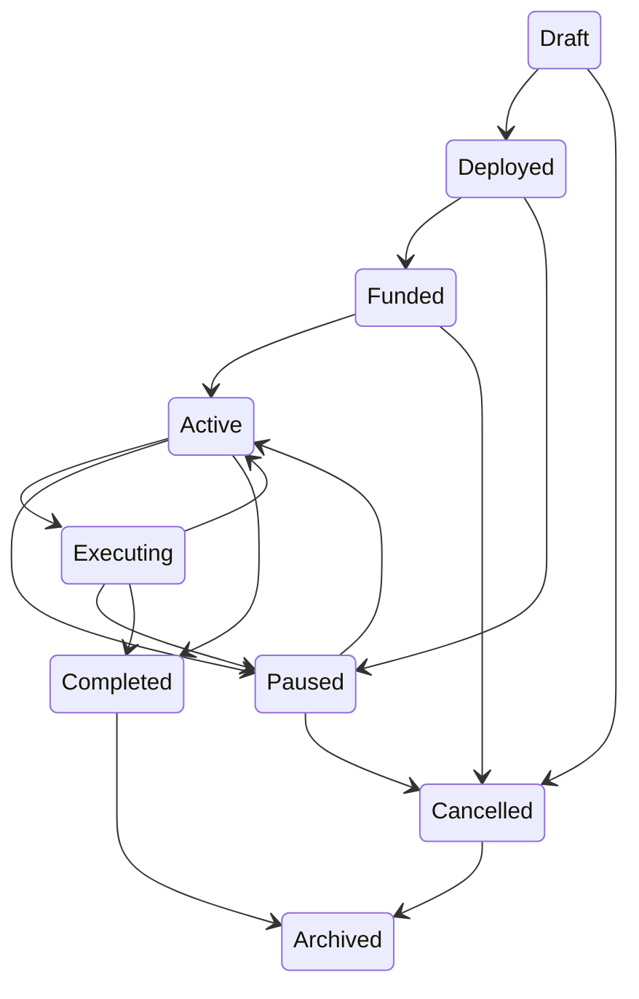

# PactOS Soroban Contracts

## Scope and deployment boundary

The contract workspace implements the finalized PactOS smart-contract modules. It uses Soroban SDK 26, Rust `no_std`, explicit errors, bounded programs, and hash references for large agreement metadata. Deployments must be independently security-audited before custodying production assets.

## Contracts and public methods

| Contract | Public methods |
| --- | --- |
| Agreement Registry | `initialize`, `register`, `get`, `transition`, `update_hashes` |
| Agreement Runtime | `initialize`, `install_program`, `execute`, `execution_nonce` |
| Distribution | `distribute` |
| Escrow | `initialize`, `lock`, `release`, `refund`, `get` |
| Permission | `initialize`, `grant_role`, `revoke_role`, `set_threshold`, `grant_approval`, `has_role`, `approvals_met` |
| Treasury | `initialize`, `set_fee_bps`, `collect`, `withdraw`, `fee_bps` |
| Audit | `initialize`, `record`, `sequence` |

## Storage decisions

- Agreement records are persistent and contain only IDs, addresses, timestamps, status, version, and 32-byte metadata/rule commitments.
- ADL programs are bounded to 64 instructions. Each instruction holds an opcode, next instruction, and 32-byte operand commitment.
- Approval entries are persistent and agreement/action/approver scoped; audit storage only maintains a compact monotonically increasing receipt sequence. Full history is indexed from events.
- Reentrancy locks are temporary storage, minimizing state rent for per-transaction protection.

## Lifecycle

## Events

Contract events use compact stable symbols: `agrc`, `agru`, `agrs`, `execstart`, `adl_step`, `exec_done`, `payout`, `esclock`, `escrel`, `escrefund`, `approval`, `feecoll`, and `audit_rec`. Indexers map symbols to the product event names in the architecture.

## Security notes

- Every mutating user operation requires `Address::require_auth`; admin operations require the initialized admin.
- State transitions are allow-listed, programs are bounded/forward-only, splits must total 10,000 bps, and all arithmetic uses checked operations.
- Soroban transaction rollback makes distribution and escrow settlements atomic.
- Admin keys should be multisig/managed off-chain. Contract code has no upgrade entrypoint; upgrades require a controlled redeployment/migration process.

## Testnet workflow

1. Install the current Stellar CLI and configure a funded Testnet source identity.
2. Copy `.env.example` to your untracked environment file and export its values.
3. Run `cargo test`, then `stellar contract build`.
4. Run `scripts/deploy-testnet.sh`; initialize each deployed contract using its alias and the configured admin address.

Never put production secret keys in environment files, source control, or frontend code.
